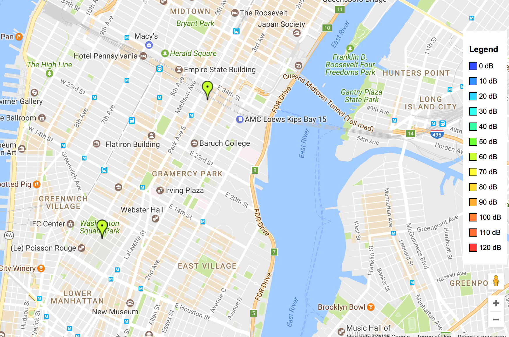

##A Prototype of IoT Platform for Smart Cities

###About

This is the library for an IoT project completed as a part of the course "Foundations of Networks and Mobile Systems" at NYU.
There exists an AWS EC2 instance for backend server control of mobile devices with multiple sensors.
The idea is to remotely control android devices, for data collection purposes, and send the data back to the central server.
At which point we can store it for later data analysis/ML.

The android app is modified from Aircasting   [aircasting.org](http://aircasting.org).

### Contributions

Mobile Team:     Joe Zuhusky,    Soumie Kumar  
Networking Layer: Wesley Painter, Zal Bhathena  
Server/Controller Team:     Hongtao Cheng,  Wenliang Zhao  
Supervisors:     Prof. Lakshmi Subramanian, Fatima Zarinni, Shiva Radhakrishnan

#### Contact

You can contact the authors by email at [wz927@nyu.edu](mailto:info@wz927.nyu.edu).
or Joe Zuhusky at [jzuhusky@nyu.edu](mailto:jrz263@nyu.edu).

### Usage
1. Package server folder as a jar (we used IntelliJ)
2. Install the app on your android device
      -> See README File in the Mobile Folder for further instructions / advice
3. To set up AWS and run the server and sql server, first create an ubuntu EC2 instance(register an account https://console.aws.amazon.com/console/home if needed).
After ec2 is ready, press connect and ssh to the remote machine from the directory where your private key is located. To upload the server code, first build an executable jar from the java code, then scp the jar to the remote machine. Then create a Mysql server on EC2, set the Mysql password to 1234. After this setup, run the server by doing java -jar [servername].jar on the terminal of the remote machine.
4. Acquire the server's public ip, update it in the app. Then open Aircasting app on you phone, the app will start pinging the server immediately, and the server will queue the messages up for later processing. The server will send start collecting data command to a phone upon receiving the very first message from that phone.
5. The result will be shown on google map and be saved as html file by running the python code iotQueryPlotter.py.
6. You can also setup an Apache web server if you want to check the results by just visiting the public ip address of the remote server in real time.

### Results

### License
